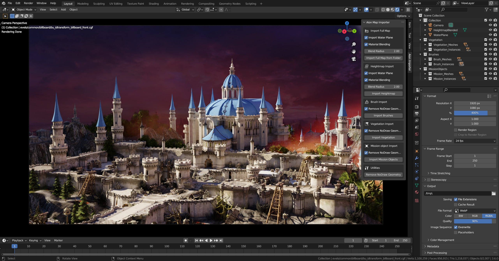
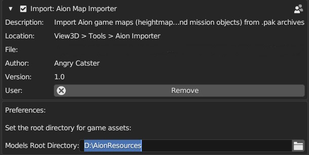

This is a blender addon to import AION online levels into the blender.

# Extracting assets

1. Download the [batch file](https://drive.google.com/file/d/1d_KgnwPcXEWDDmspeOqpbeoTMW6xXrmw/view?usp=sharing) that extracts the needed assets from your aion directory. The .bat file is in plain text, the "pak2zip.exe" is taken from [AION Encdec](https://github.com/Iswenzz/AION-Encdec), and "7z.exe" is an official 7zip binary. 
If you still feel uncomfortable running this bat, you can read what it does and do these steps manually.
2. Put the "createRes.bat" along with the other files from the archive into your aion directory (folder with bin64, Data, L10N etc.) and run the bat file. After running the bat, there should be "AionResources" folder created (5 - 14 GB in size based on the game version).

# Preparing blender

1. Download and install [blender 3.6](https://download.blender.org/release/Blender3.6/blender-3.6.0-windows-x64.zip). Other versions of blender will not work.
2. Download and install [this fork of io_scene_cgf](https://github.com/234523413432634/io_scene_cgf) and io_import_aion_level.py as blender addons.
3. In the aion map importer preferences, set the path to AionResources, which we created in the previous steps.

# importing a level

Now that everything is set up, press "N" to open the side panel in blender, select the "Aion importer" tab in it.

Here you can import a full level or individual parts of the level.

After pressing the import button, select the path to the map folder in the "AionResources" folder. Example: "D:\AionResources\Levels\lf1". After selecting this folder, the import process will begin.

The import time depends on your CPU and the map size. Importing dungeons should take a minute or two, while the large open maps could easily take 3 - 10 minutes.

A fully imported map might run at a very low fps, as your usual open world map could easily have 16k - 40k objects. You can partially alleviate this by joining all individual objects (like entire vegetation collection) into a singular mesh by selecting all needed objects and pressing CTRL+J.

# Limitations & bugs

1. Blender 3.6 only. This is an io_scene_cgf limitation. If the author of the addon decides to update it, then the map importer could easily be brought to newer versions as well. Though nothing stops you from importing a level into blender 3.6, saving the scene, and then opening that scene in newer versions.
2. Some (VERY few) objects are imported in a visually broken state. Once again, likely a io_scene_cgf issue. CGF format is very complex, so it is understandable that there will be a few wonky meshes.

# Credits
[keyhom](https://github.com/keyhom) for [io_scene_cgf](https://github.com/keyhom/io_scene_cgf) - the plugin that imports cgf models into the blender. I've modified it slightly so it imports models even if creation of their materials fails.

[zzsort](https://github.com/zzsort) for [monono2](https://github.com/zzsort/monono2) - for having the information about aion map formats (brush.lst, objects.lst, land_map.h32).

Deepseek-V3 for coding almost everything 😅

Claude for making the initial implementation of the material blending for the terrain. GLM-4.5 and Qwen3-Coder-480B-A35B for fixing it and making it work properly and look good.

Kimi K2.5 Thinking for Update 1 features and fixes